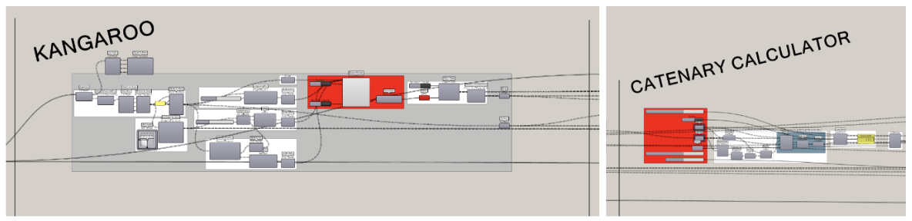
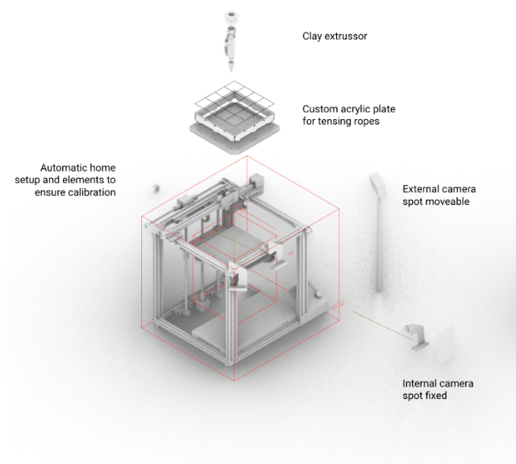

## About

This script allows designing a cantilever geometry ready to be 3d printed over tensors using as an input a network of tensors and getting as an output the g-code. 

This research is developed in the Postgraduate in 3D Printing Architecture - 2022-2023. More information about the design process can be found at [blog.iaac.net](https://blog.iaac.net/) or in the Credits section.

## Prerequisites & Requirements

* Rhinoceros 3D version 7 (Win only). 
* Grasshopper plugins: 
    * Kangaroo Physics
    * Parakeet (Network Regions)
    * Anemone (Loop start and Loop end)
    * Lunch Box (Reverse Surface Direct, Sort Duplicated Curves)
    * Heteroptera
    * TO BE COMPLETED

_Not working on Mac due to several plugins needed._

## Installation

* Open .gh file

## Units

The system works in millimeters. It can be used in generic units.

## Workflow

The basic Grasshopper workflow could be divided into the following basic steps:

TO BE INCLUDED: IMAGES OF ORGANIZED GH SCRIPT

1. Import network of tensors as curves (or generate them parametrically)
2. Wall design
    1. Design wall 
    2. Generate wall grid subdivision
3. Vaults design
    3. Design vaults 
    4. Generate vault grid subdivision based on wall subdivision
4. Redesign wall to improve vault support (optional)
    5. Adapt wall top period based on vaults
5. Get sliced printing path for walls and vaults
6. Save G-Code

In order to get the sliced printing path for vaults you will need to activate GH “data dam” and “buttons” under Kangaroo, Catenary Calculator, and following Data Dam

>>>>>  gd2md-html alert: inline image link here (to images/image2.png). Store image on your image server and adjust path/filename/extension if necessary.  (<a href="#">Back to top</a>)(<a href="#gdcalert3">Next alert</a>) >>>>> 

>>>>>  gd2md-html alert: inline image link here (to images/image3.png). Store image on your image server and adjust path/filename/extension if necessary.  (<a href="#">Back to top</a>)(<a href="#gdcalert4">Next alert</a>) >>>>> 

>>>>>  gd2md-html alert: inline image link here (to images/image4.png). Store image on your image server and adjust path/filename/extension if necessary.  (<a href="#">Back to top</a>)(<a href="#gdcalert5">Next alert</a>) >>>>> 

## Printers and Robots

The final set of contoured curves can be used on the different printers of robots. For the purpose of this research, a table 3D Printer and a Kuka robot were used.

### 3D Printer

### 

>>>>>  gd2md-html alert: inline image link here (to images/image5.png). Store image on your image server and adjust path/filename/extension if necessary.  (<a href="#">Back to top</a>)(<a href="#gdcalert6">Next alert</a>) >>>>> 

* 3D printer
* Cartridge, clay holder, and nozzle
* Air pressure pump
* Max size: 220 x 220 x 180 mm
* Scales: 1.10 to 1.5

### ABB or KUKA robots

>>>>>  gd2md-html alert: inline image link here (to images/image6.png). Store image on your image server and adjust path/filename/extension if necessary.  (<a href="#">Back to top</a>)(<a href="#gdcalert7">Next alert</a>) >>>>> 

* Robot
* Cartridge, clay holder, and nozzle
* Air pressure pump or manual pump
* Max size: variable
* Scales: 1.1 to 1.5

### Wasp crane

>>>>>  gd2md-html alert: inline image link here (to images/image7.png). Store image on your image server and adjust path/filename/extension if necessary.  (<a href="#">Back to top</a>)(<a href="#gdcalert8">Next alert</a>) >>>>> 

_Image credit: WASP_

* Crane 
* Clay holder and nozzle
* Air pressure pump or manual pump
* Max size: Cylinder 3800 x 2000 mm
* Scales: 1.1 to 1.5

---

## Credits

2022 3DPA / [iaac](https://github.com/IaaC)

This research is a project of IAAC, Institute for Advanced Architecture of Catalonia developed in the Postgraduate in 3D Printing Architecture - 2022-2023 by the student(s) Nestor Beguin, Paco Pioline, and Francisco Magnone Rienzi during the course 3DPA 22/23: Research with Oriol Carrasco and Ashkan Foroughi.

### Research Team

Nestor Beguin, Paco Pioline, [Francisco Magnone Rienzi](https://github.com/fmruy)

### Source Plugins

This project contains plugins and codes based on free open-source and proprietary projects:

* [Kangaroo Physics](https://www.food4rhino.com/en/app/kangaroo-physics) by Daniel Piker - License Type: Proprietary
* [Parakeet](https://www.food4rhino.com/en/app/parakeet) by Parakeet3d - License Type: Proprietary
* [Anemone](https://www.food4rhino.com/en/app/anemone) by Mateusz Zwierzycki - License Type: Other
* [Lunch Box](https://www.food4rhino.com/en/app/lunchbox) by Nathan Miller - License Type: Other
* [Heteroptera](https://www.food4rhino.com/en/app/heteroptera) by Amin Bahrami - License Type: Other

## License

[MIT License](https://opensource.org/licenses/MIT)
